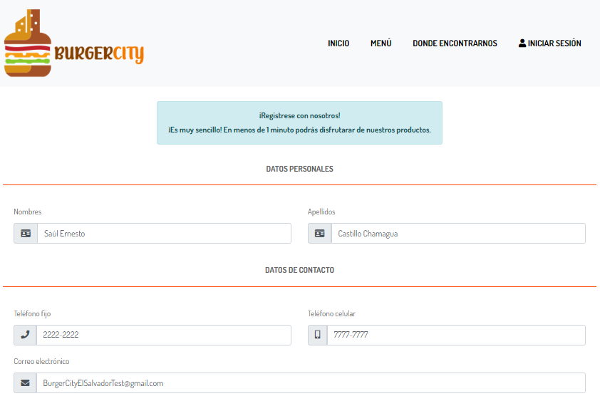
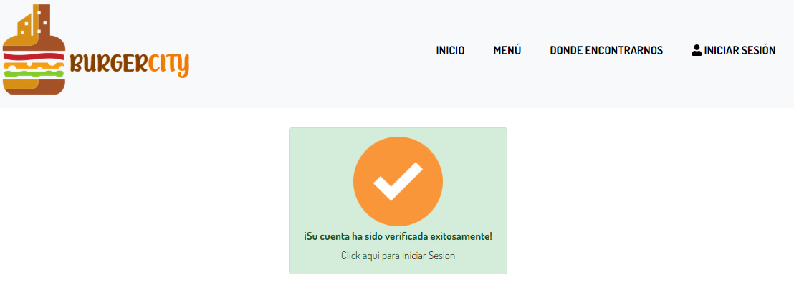

<div id="top"></div>

<!-- PROJECT LOGO -->
<br />
<div align="center">
  <a href="https://github.com/secch97/RestauranteWeb">
    
  </a>
  <h3 align="center">Simple e-Commerce Restaurant project</h3>
</div>

<!-- TABLE OF CONTENTS -->
<details>
  <summary>Table of Contents</summary>
  <ol>
    <li>
      <a href="#about-the-project">About The Project</a>
      <ul>
        <li><a href="#built-with">Built With</a></li>
      </ul>
    </li>
    <li>
      <a href="#getting-started">Getting Started</a>
      <ul>
        <li><a href="#prerequisites">Prerequisites</a></li>
        <li><a href="#installation">Installation</a></li>
      </ul>
    </li>
  </ol>
</details>

<!-- ABOUT THE PROJECT -->
## About The Project
<div align="center">
    
</div>
<br>

Non-profit project carried out to support a micro business in the country of El Salvador, Central America in 2020-2021. This project is still in progress.

This project has been carried out because, despite the increase in the use of the Internet in El Salvador, many micro, small and medium-sized companies in our country (El Salvador) do not have a website to publicize (and offer) their services. This is the case of a part of the food establishments in our country. The fact that many of these establishments ignore their online presence is nothing new in our country; this is a situation that has been caused, many times, because:
• Some of these establishments prefer to use social networks such as Facebook and Whatsapp to only publicize their services and offer them through a telephone line.
• Some of these establishments do not have the ability to invest in (and maintain) a website.
• Some of these establishments just don't want to invest in (and maintain) a website because they are profitable as is.

Regardless of its causes, it is extremely important that these food establishments recognize that our country is already in a new reality caused by the COVID-19 pandemic.

The proposal presented in this repository is made with the purpose of providing ease, comfort and security for users, to carry out activities such as purchases, orders and view food menus of a small restaurant that soon plans to enter the Internet, from any technological device (PC, Smartphone, Tablet, among others) which will allow greater time savings by avoiding going to the location of the restaurant to carry out said activities, taking into account the external factor of the difficulties that have emerged these years due to the appearance of the Coronavirus pandemic on a global scale.


<p align="right">(<a href="#top">back to top</a>)</p>


### Built With

This project is being built with the following technologies:

* [ASP .NET Framework](https://dotnet.microsoft.com/en-us/apps/aspnet)
* [Javascript](https://www.javascript.com/)
* [C#](https://docs.microsoft.com/en-us/dotnet/csharp/)
* [Bootstrap](https://getbootstrap.com)
* [SQL Server](https://www.microsoft.com/en-us/sql-server/sql-server-downloads)

<p align="right">(<a href="#top">back to top</a>)</p>


<!-- GETTING STARTED -->
## Getting Started

In this section you will find the instructions to follow to be able to execute this project locally:

### Prerequisites

You need to have the following programs installed on your computer:
* Microsoft Visual Studio.
* SQL Server 2019 Developer Edition.
* SQL Server Management Studio 18.

### Installation

1. On SQL Server, run the following scripts in order:
  * ScriptBD.sql: This script allows you to create the database that allows the present project to be functional.
  * Procedimientos.sql: This script allows you to create the necessary SQL Server functions and stored procedures that the project uses.
  * InicializacionDatos.sql: This script allows you to insert initial values in the tables of the created database so that the project can work correctly. In addition, this script allows you to create an administrator user to be able to enter the administration and data management panel. Feel free to modify the admin user to your liking, just keep in mind that the passwords created in this project are encrypted. The encrypted password value is 123 for the proposed user.

2. Clone the repo
   ```sh
   git clone https://github.com/secch97/RestauranteWeb
   ```
3. Modify the connection to the database in the Web.config file, line 75. Here you must enter the name of the local server on which you previously created the database.
 
4. You have finished all the steps. You can now run the program with the IIS EXPRESS server from Visual Studio.

<p align="right">(<a href="#top">back to top</a>)</p>


<!-- USAGE EXAMPLES -->
## Usage

Here are some uses of this project:
* Registering new user:
<div align="center">
    
</div>
<div align="center">
    
</div>
<div align="center">
    
</div>
<div align="center">
    
</div>
<div align="center">
    
</div>
<br>
* Logging in:
<div align="center">
    
</div>
<br>
* Buying a product:
<div align="center">
    
</div>
<div align="center">
    
</div>
<div align="center">
    
</div>
<div align="center">
    
</div>
<br>
* Cart:
<div align="center">
    
</div>
<br>
* Checkout:
<div align="center">
    
</div>
<div align="center">
    
</div>
<div align="center">
    
</div>
<br>
Clone the project to see more functionalities!
<p align="right">(<a href="#top">back to top</a>)</p>

<p align="right">(<a href="#top">back to top</a>)</p>
